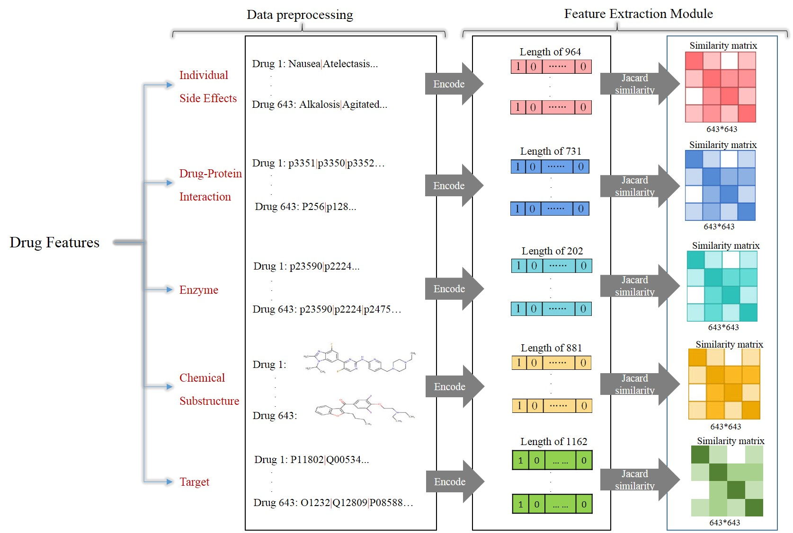
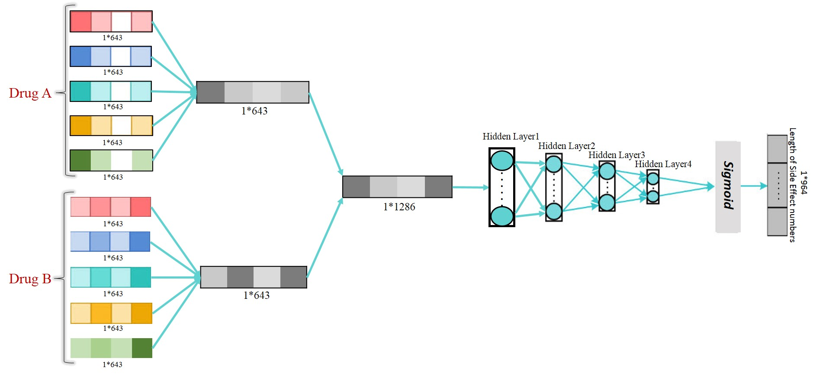

# PSECNN
Detection of polypharmacy side effects by integrating multiple data sources and convolutional neural networks

#### Author: [Mahdi Babaei] ( mahdi.babaei@qom.ac.ir)
#### Author: [Amir Lakizadeh] ( lakizadeh@qom.ac.ir)

## Overview

This repository contains code necessary to run the PSECNN algorithm. PSECNN is a method for predicting possible polypharmacy side effects.
  
## Usage: Polypharmacy

We construct a multilabel multiclass classification model of five different drug features and 
polypharmacy side effects, which are represented as drug-drug interactions.

Overview of the first main part of PSECNN model architecture.

The second part of PSECNN model architecture. The feature vectors of a drug are merged into a unique feature vector, and then two unique feature vectors are concatenated as the representation of the drug pairs.

## Datasets: URLs

The real dataset is available in dataset folder.

here is the URLs of used datasets.

DrugBank: http://www.drugbank.ca/

SIDER: http://www.sideeffects.embl.de/	

STITCH: http://www.stitch.embl.de/

PubChem: http://www.pubchem.ncbi.nlm.nih.gov/

KEGG: http://www.genome.jp		

TWOSIDES: http://www.tatonettilab.org/twosides

OFFSIDES: http://www.tatonettilab.org/offsides

### Running the code

Run the code with flowing command:

    $ python main.py
    

## Requirements

PSECNN is tested to work under Python 2 and Python 3. 

Latest version of SQLite is needed for dataset.

Recent versions of Tensorflow, sklearn, networkx, numpy, and scipy are required. All the required packages can be installed using the following command:

    $ pip install -r requirements.txt

## License

PSECNN is licensed under the University of Qom.
